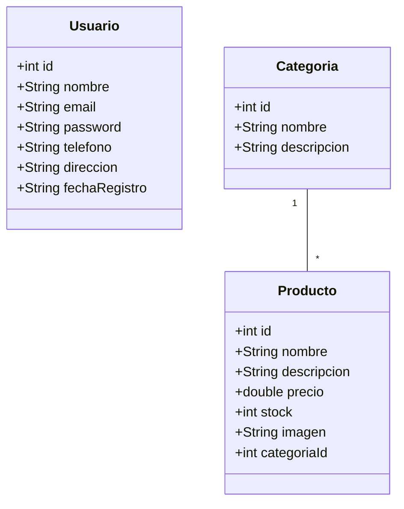

# Documentación de Requisitos - SportShock

## 1. Casos de Uso

### 1.1 Registro de Usuario
- **Actor**: Cliente
- **Descripción**: El cliente se registra en el sistema proporcionando sus datos personales
- **Precondiciones**: Ninguna
- **Flujo Principal**:
  1. Cliente accede al formulario de registro
  2. Cliente ingresa sus datos personales
  3. Sistema valida los datos
  4. Sistema crea la cuenta
  5. Sistema redirige al inicio de sesión

### 1.2 Inicio de Sesión
- **Actor**: Cliente
- **Descripción**: El cliente inicia sesión en el sistema
- **Precondiciones**: Cliente debe estar registrado
- **Flujo Principal**:
  1. Cliente accede al formulario de login
  2. Cliente ingresa credenciales
  3. Sistema valida credenciales
  4. Sistema permite acceso

### 1.3 Ver Catálogo de Productos
- **Actor**: Cliente
- **Descripción**: Cliente visualiza los productos disponibles
- **Precondiciones**: Ninguna
- **Flujo Principal**:
  1. Cliente accede al catálogo
  2. Sistema muestra lista de productos
  3. Cliente puede filtrar por categoría

## 2. Historias de Usuario

### 2.1 Registro
Como cliente nuevo
Quiero poder registrarme en el sistema
Para poder realizar compras

### 2.2 Inicio de Sesión
Como cliente registrado
Quiero poder iniciar sesión
Para acceder a mi cuenta

### 2.3 Ver Productos
Como cliente
Quiero ver el catálogo de productos
Para poder elegir qué comprar

## 3. Diagrama de Clases

## 4. Tecnologías Seleccionadas

- **Backend**: Java EE (Servlets y JSP)
- **Base de Datos**: MySQL
- **Control de Versiones**: Git
- **Servidor Web**: Apache Tomcat
- **IDE**: Eclipse IDE for Enterprise Java Developers

## 5. Plan de Trabajo

1. Configuración del Entorno
   - Instalación de herramientas
   - Configuración de base de datos
   - Configuración del proyecto

2. Desarrollo
   - Implementación de modelos
   - Desarrollo de DAOs
   - Creación de servlets
   - Desarrollo de vistas JSP

3. Pruebas
   - Pruebas unitarias
   - Pruebas de integración
   - Pruebas de usuario

4. Documentación
   - Documentación técnica
   - Manual de usuario
   - Documentación de API 